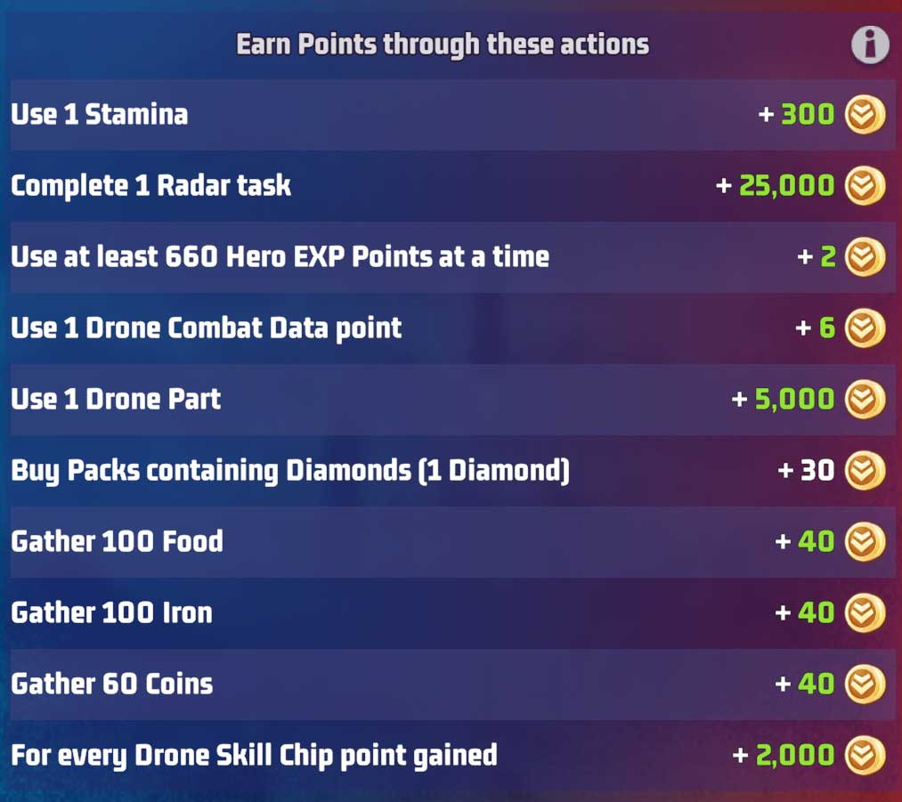

# Day 1: Radar Training (Monday)

Tihs event starts Sunday night at 10pm EST.  The team that can earn the most points will win for that day. Lets see how you can earn points.

## Earning Points

### Drone Upgrades

Upgrading drone will get you the best yeilds for points.  It is however hard to gather the required points dans gears to be able to do the upgrades.

::: tip Pro tip: Saving Cogs and Points 

Like most things for VS challenges you should only use items when it will earn you points in one of the events.  This is especially true for drone upgrades save up your cogs and data points for Monday's and no other day. 

:::

### Radar Tasks

One of the easiest way to earn points on day 1 is by completing radar tasks.  Tasks reset at different times for each player but they are refreshed every 6 hours. 

::: tip Pro tip: Saving Radar Tasks
You can queue and save several radar tasks and queue them for later.  So it's a good idea to save them before  the event starts and get extra points.  Start saving them starting 10pm EST Saturday night and you will have a full set of tasks when the event start.

:::

### Stamina

Any item that use stamina wll earn you earns points.

::: tip Pro tip: Starting with full stamina

The best thing to get an edge with stamina is to start the day with a full pool.  Avoid spending it at the end of the day on Sunday so you can start with a full guage when the day rolls over.  Even better use a free stamina claim at the end of Sunday to get upto 170 stamina points to start the day. (Free claims will allow you to go over the 120 limit)

:::

### Experience Points

You will earn points for upgrading your hero levels for this day.

::: warning Pro tip: Save them for day 4

It's probably best to use them only if you need to and save them for Day 4: Train Heroes, since it will earn you more points on that day.

:::

### Gathering Ressources

Another easy way to earn points is by gathering resources from mining tiles.  When idle you should be mining as much as you can.

::: info Pro tip: Use high level tiles

If you need to go away for a while look for level 8 or higher mines.  You will find high level ressource tiles around the caiptol.  This will ensure you can maximize your points when away for long periods of time.

:::

## Preparing for nex day: Base Expansion

- Leave building upgrades that have finished un-wrapped
- Save Survivor tickets
- Keep undispatched UR trucks for the next day
- Save construction speed ups

## Day 1: Points Breakdown

