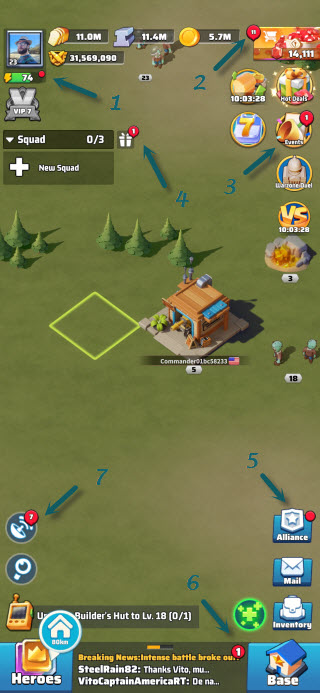

# Basic Strategies

## Where to put your attention

Every red dot on an icon or button means there is something that requires your attention.

If you look at the image below each green arrow points at an item that needs attention.

1. You can claim some extra stamina (available twice per day)
2. You can get some free diamonds by looking at the available packages for sale
3. There some action required in an event such as Arms Rrace, Count Master or other.
4. You have unclaimed rewards from a battle or gathering
5. You can help alliance, memeber or donate to alliance tech
6. Unread message in world chat, alliance chat or private message
7. You have unclaimed radar tasks